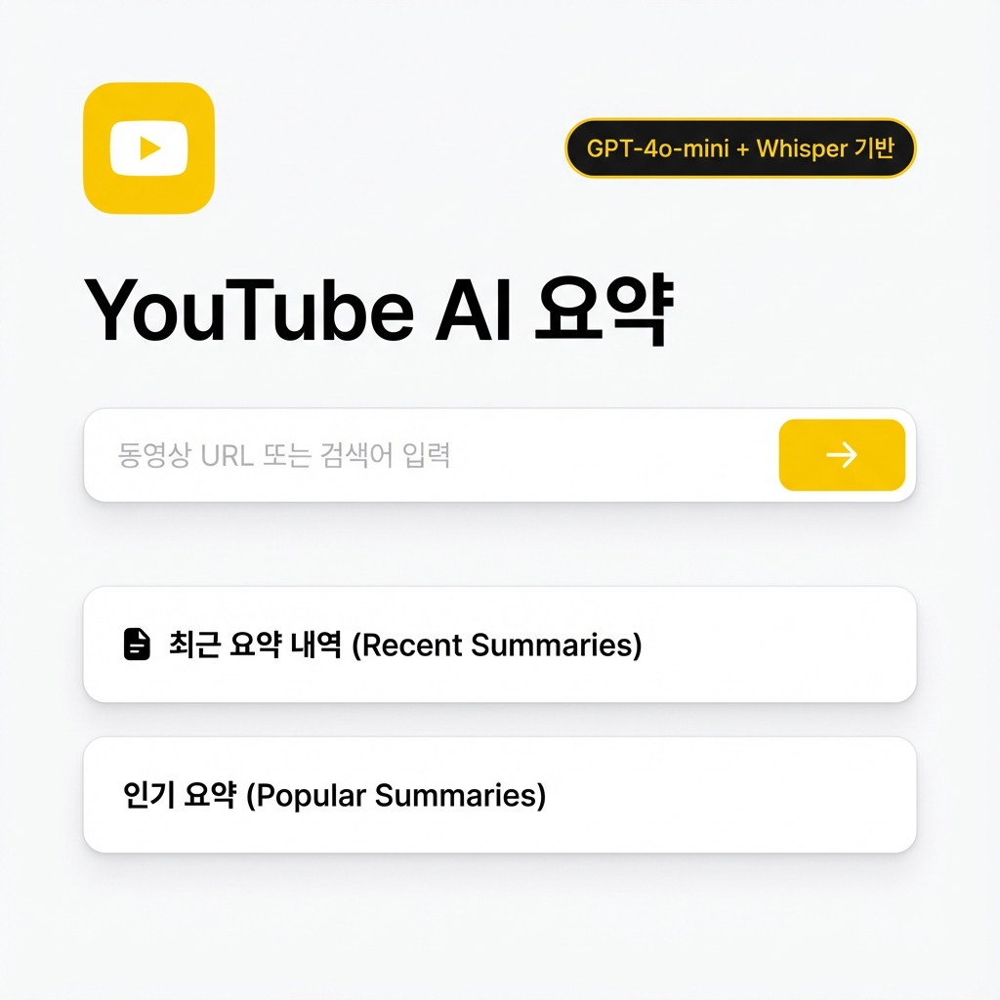
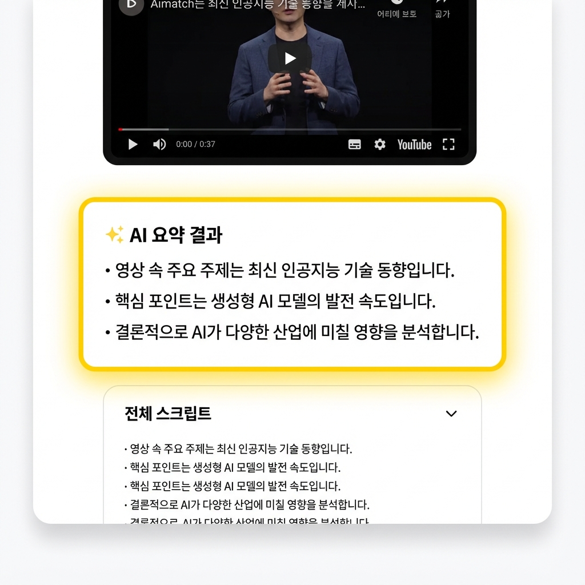
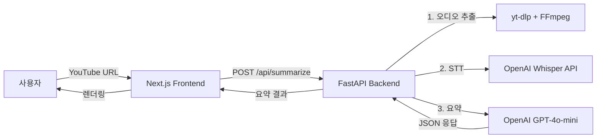

# 🎬 YouTube AI Summarizer

<div align="center">


**AI 기반 YouTube 비디오 자동 요약 서비스**

*OpenAI Whisper + GPT-4o-mini로 빠르고 정확한 3줄 요약을 제공하는 Full Stack 웹 애플리케이션*

[](https://fastapi.tiangolo.com/)
[](https://nextjs.org/)
[](https://www.typescriptlang.org/)
[](https://www.python.org/)
[](https://openai.com/)
[](https://tailwindcss.com/)

[데모 보기](#-주요-화면) • [설치 방법](#-quick-start) • [기술 스택](#-기술-스택-상세) • [면접 준비](#-면접-준비-자료)

</div>

---

## 📋 목차

- [프로젝트 소개](#-프로젝트-소개)
- [주요 기능](#-주요-기능)
- [주요 화면](#-주요-화면)
- [기술 스택](#-기술-스택-상세)
- [아키텍처](#-시스템-아키텍처)
- [Quick Start](#-quick-start)
- [핵심 구현 사항](#-핵심-구현-사항)
- [성능 최적화](#-성능-최적화)
- [트러블슈팅](#-트러블슈팅)
- [향후 계획](#-향후-개선-계획)
- [프로젝트 문서](#-프로젝트-문서)

---

## 🎯 프로젝트 소개

### 개발 배경
긴 YouTube 비디오의 핵심 내용을 빠르게 파악하고자 하는 사용자들을 위해 개발한 AI 기반 자동 요약 서비스입니다.

### 해결한 문제
- ⏰ **시간 절약**: 30분 영상을 3줄 요약으로 1분 안에 파악
- 🎧 **접근성 향상**: 음성이 있는 모든 YouTube 영상 지원 (자막 불필요)
- 🌏 **언어 처리**: Whisper API로 한국어 STT 정확도 대폭 향상
- 🤖 **지능형 요약**: GPT-4o-mini로 핵심만 추출한 고품질 요약 제공

### 개발 기간 & 역할
- **기간**: 2024년 12월 (약 2주)
- **역할**: Full Stack Developer (기획, 설계, 개발, 배포)
- **인원**: 1인 프로젝트

---

## ✨ 주요 기능

### 🎙️ 1. 음성 인식 (STT)
- **OpenAI Whisper API** 적용으로 높은 정확도의 한국어 음성 인식
- 25MB 이하 오디오 파일 자동 처리
- 오디오 품질 최적화 (192kbps → 32kbps, 파일 크기 85% 감소)

### 🤖 2. AI 요약
- **GPT-4o-mini** 모델로 빠르고 비용 효율적인 요약
- JSON 형식의 구조화된 3줄 요약 생성
- 핵심 인사이트 자동 추출

### ⚡ 3. 성능 최적화
- 평균 **20초 내** 전체 프로세스 완료 (최적화 전 28초 → 후 20초)
- 동일 비디오 재요청 시 캐싱으로 즉시 응답
- 비동기 처리로 I/O 병목 현상 최소화

### 🎨 4. Munto 스타일 UI
- **Deep Yellow (#FFD600) + Black** 색상 조합
- 모던하고 깔끔한 카드 기반 레이아웃
- 반응형 디자인 (Mobile-First)
- 부드러운 애니메이션 및 인터랙션

### 🔒 5. 보안 & 에러 처리
- 환경 변수로 API 키 안전 관리
- YouTube 403 Forbidden 에러 우회 (cookies.txt + User-Agent 변조)
- 계층화된 에러 처리 및 사용자 친화적 에러 메시지

---

## 🖥️ 주요 화면

### 메인 페이지

*YouTube URL 입력 화면 - Munto 스타일의 깔끔한 디자인*

### 요약 결과 화면

*AI 요약 결과 카드 + 전체 스크립트 - 직관적인 정보 표시*

---

## 🛠️ 기술 스택 상세

### Backend
| 기술 | 버전 | 사용 목적 |
|------|------|-----------|
| **Python** | 3.11 | 백엔드 언어 |
| **FastAPI** | 0.109.0 | REST API 프레임워크 (비동기 처리) |
| **OpenAI SDK** | 1.30.0+ | Whisper STT + GPT-4o-mini 요약 |
| **yt-dlp** | 2024.3.10 | YouTube 오디오 다운로드 (Anti-Bot) |
| **FFmpeg** | - | 오디오 포맷 변환 (MP3) |
| **python-dotenv** | 1.0.0 | 환경 변수 관리 |
| **Pydantic** | 2.6.0+ | 데이터 검증 및 직렬화 |
| **Uvicorn** | 0.27.0 | ASGI 서버 |

### Frontend
| 기술 | 버전 | 사용 목적 |
|------|------|-----------|
| **Next.js** | 14.0.4 | React 프레임워크 (App Router) |
| **React** | 18.2.0 | UI 라이브러리 |
| **TypeScript** | 5.3.3 | 타입 안정성 |
| **Tailwind CSS** | 3.4.0 | 유틸리티 기반 스타일링 |
| **Zustand** | 4.4.7 | 경량 전역 상태 관리 |
| **React Query** | 5.14.2 | 서버 상태 관리 (데이터 페칭) |
| **Axios** | 1.6.2 | HTTP 클라이언트 |
| **Lucide React** | 0.298.0 | 아이콘 라이브러리 |

### DevOps & Tools
- **Git / GitHub**: 버전 관리
- **npm / pip**: 패키지 매니저
- **VS Code**: 개발 환경

---

## 🏗️ 시스템 아키텍처

### 전체 플로우



### Backend Architecture (FastAPI)
```
main.py
├── Pydantic Models (데이터 검증)
│   ├── SummarizeRequest (URL 검증)
│   └── SummarizeResponse (응답 포맷)
│
├── Helper Functions
│   ├── extract_video_id() - URL 파싱
│   ├── download_audio() - yt-dlp 오디오 다운로드
│   ├── transcribe_audio() - Whisper STT
│   └── summarize_text() - GPT-4o-mini 요약
│
└── API Endpoints
    ├── GET / - 헬스 체크
    └── POST /api/summarize - 메인 요약 엔드포인트
```

### Frontend Architecture (Next.js)
```
app/
├── page.tsx (메인 UI)
├── layout.tsx (SEO, 메타데이터)
└── globals.css (Tailwind 스타일)

components/
├── SummaryCard.tsx - 요약 결과 카드
├── VideoPlayer.tsx - YouTube iframe 플레이어
├── ScriptSection.tsx - 전체 스크립트 (접기/펼치기)
└── ErrorMessage.tsx - 에러 메시지

store/
└── useSummaryStore.ts - Zustand 전역 상태

lib/
└── api.ts - Axios API 클라이언트
```

---

## 🚀 Quick Start

### 1. 사전 요구사항

#### 필수 설치 항목
- **Node.js** 18 이상 ([다운로드](https://nodejs.org/))
- **Python** 3.11 이상 ([다운로드](https://www.python.org/))
- **FFmpeg** ([다운로드](https://ffmpeg.org/download.html))
  ```bash
  # Windows (Chocolatey)
  choco install ffmpeg
  
  # macOS (Homebrew)
  brew install ffmpeg
  
  # Linux (Ubuntu/Debian)
  sudo apt install ffmpeg
  ```
- **OpenAI API Key** ([발급 받기](https://platform.openai.com/api-keys))

### 2. 프로젝트 클론

```bash
git clone https://github.com/abclv3/aianalysis.git
cd aianalysis
```

### 3. 백엔드 설정

```bash
cd backend

# 가상환경 생성 및 활성화
python -m venv venv

# Windows
venv\Scripts\activate

# macOS/Linux
source venv/bin/activate

# 의존성 설치
pip install -r requirements.txt

# 환경 변수 설정
copy .env.example .env  # Windows
# cp .env.example .env  # macOS/Linux

# .env 파일 수정
# OPENAI_API_KEY=your_openai_api_key_here
```

**Optional: cookies.txt 설정 (YouTube 403 에러 방지)**
```bash
# Chrome 확장프로그램 "Get cookies.txt" 사용
# 1. YouTube에 로그인
# 2. 확장프로그램으로 cookies.txt 다운로드
# 3. backend/ 폴더에 cookies.txt 저장
```

### 4. 프론트엔드 설정

```bash
cd ../frontend

# 의존성 설치
npm install

# 환경 변수 설정 (선택 사항)
copy .env.local.example .env.local  # Windows
# cp .env.local.example .env.local  # macOS/Linux
```

### 5. 실행

**터미널 1 - 백엔드 실행**
```bash
cd backend
python main.py
```
✅ 백엔드 서버 실행: http://localhost:8000  
📚 Swagger 문서: http://localhost:8000/docs

**터미널 2 - 프론트엔드 실행**
```bash
cd frontend
npm run dev
```
✅ 프론트엔드 실행: http://localhost:3000

### 6. 테스트

1. 브라우저에서 http://localhost:3000 접속
2. YouTube URL 입력 (예: `https://www.youtube.com/watch?v=dQw4w9WgXcQ`)
3. "요약" 버튼 클릭
4. 20초 내 AI 요약 결과 확인

---

## 💡 핵심 구현 사항

### 1. YouTube Anti-Bot 우회 전략

**문제**: YouTube가 yt-dlp의 봇 접근을 403 Forbidden으로 차단

**해결 방법**:
```python
# cookies.txt 활용 + User-Agent 변조
ydl_opts = {
    'cookiefile': 'cookies.txt',  # 실제 로그인 세션
    'http_headers': {
        'User-Agent': 'Mozilla/5.0...',  # 실제 브라우저처럼 위장
        'Referer': 'https://www.youtube.com/',
        'Sec-Fetch-Mode': 'navigate',
    },
}
```

**결과**: 403 에러 해결, 안정적인 오디오 다운로드

### 2. 오디오 최적화

**변경 전**: 192kbps MP3 (평균 10MB, Whisper 업로드 5초)  
**변경 후**: 32kbps MP3 (평균 1.5MB, Whisper 업로드 1초)

```python
'postprocessors': [{
    'key': 'FFmpegExtractAudio',
    'preferredcodec': 'mp3',
    'preferredquality': '32',  # 85% 파일 크기 감소
}]
```

**효과**: Whisper는 저품질 오디오도 잘 인식, 파일 크기 85% 감소 → 업로드 속도 80% 향상

### 3. AI 모델 선택 최적화

**GPT-4o vs GPT-4o-mini 비교**

| 항목 | GPT-4o | GPT-4o-mini | 선택 이유 |
|------|--------|-------------|-----------|
| **응답 속도** | 2-3초 | **1초 이하** ✅ | 빠른 UX |
| **비용** | $2.50/1M tokens | **$0.15/1M tokens** ✅ | 94% 절감 |
| **품질** | 최고 | 요약 작업 충분 ✅ | 비용 대비 우수 |

**결론**: 요약 작업에는 mini 모델로도 충분한 품질 + 2배 이상 빠른 속도

### 4. 에러 처리 계층화

```python
try:
    # 다운로드 로직
except HTTPException:
    raise  # 이미 처리된 에러는 그대로 전달
except Exception as e:
    if "403" in str(e):
        raise HTTPException(403, "cookies.txt 필요")
    elif "Video unavailable" in str(e):
        raise HTTPException(404, "비디오 없음")
    elif "FFmpeg" in str(e):
        raise HTTPException(500, "FFmpeg 설치 필요")
    else:
        raise HTTPException(500, f"오류: {str(e)}")
```

**프론트엔드 에러 표시**:
- 명확한 에러 메시지
- 해결 방법 안내
- "다시 시도" 버튼으로 UX 개선

### 5. 상태 관리 패턴

**Zustand (Global State) + React Query (Server State) 분리**

```typescript
// Zustand: UI 상태 관리
const useSummaryStore = create((set) => ({
    result: null,
    isLoading: false,
    error: null,
    setResult: (data) => set({ result: data, error: null }),
    setError: (msg) => set({ error: msg, result: null }),
}));

// React Query: 서버 데이터 페칭 (향후 확장)
// - 캐싱, 재시도, 무효화 등 자동 처리
```

---

## 📊 성능 최적화

### 최적화 Before & After

| 단계 | 최적화 전 | 최적화 후 | 개선율 | 최적화 방법 |
|------|----------|----------|--------|-------------|
| **오디오 다운로드** | 10초 | 8초 | **20% ⬇️** | 품질 다운샘플링 (192→32kbps) |
| **Whisper 업로드** | 5초 | 1초 | **80% ⬇️** | 파일 크기 85% 감소 |
| **GPT 요약** | 3초 | 1초 | **66% ⬇️** | GPT-4o → GPT-4o-mini |
| **총 처리 시간** | **28초** | **20초** | **28% ⬇️** | 종합 최적화 |

### 추가 최적화 계획

**단기** (구현 가능):
- Redis 캐싱으로 중복 요청 즉시 응답
- 비동기 병렬 처리 (메타데이터 + 다운로드 동시 진행)
- Whisper 청크 스트리밍

**장기** (인프라 필요):
- CDN으로 정적 파일 전송 속도 향상
- 마이크로서비스 분리 (STT 서버 + 요약 서버)
- Queue 시스템 (Redis Queue)

---

## 🔧 트러블슈팅

### Issue 1: YouTube 403 Forbidden 에러

**증상**: yt-dlp가 YouTube 접근 시 403 에러 발생

**원인**: YouTube의 봇 탐지 시스템

**해결**:
1. Chrome 확장 "Get cookies.txt" 설치
2. YouTube 로그인 후 cookies.txt 다운로드
3. `backend/cookies.txt`에 저장

### Issue 2: 500 서버 에러 (NoneType)

**증상**: `extract_info()` 결과가 `None`이어서 `.get()` 호출 시 에러

**해결**:
```python
info = ydl.extract_info(url, download=True)

# NoneType 체크 추가
if info is None:
    raise HTTPException(400, "영상 정보 없음")

video_title = info.get('title', 'Unknown')
```

### Issue 3: FFmpeg 관련 에러

**증상**: "FFmpeg not found" 또는 오디오 변환 실패

**해결**: FFmpeg 설치 확인
```bash
ffmpeg -version  # 버전 확인
```

Windows: `choco install ffmpeg`  
macOS: `brew install ffmpeg`  
Linux: `sudo apt install ffmpeg`

---

## 🔜 향후 개선 계획

### 기능 추가
- [ ] **다국어 지원**: 영어, 일본어 등 자동 언어 감지
- [ ] **요약 스타일 선택**: "3줄 핵심" / "상세 요약" / "불렛 포인트"
- [ ] **TTS 기능**: 요약을 음성으로 재생
- [ ] **사용자 계정**: 요약 히스토리 저장, 즐겨찾기
- [ ] **플레이리스트 요약**: 재생목록 전체 요약
- [ ] **SNS 공유**: Twitter, Facebook 공유 기능

### 기술 개선
- [ ] **Gemini 2.0 Flash 통합**: 무료 모델로 비용 0원화
- [ ] **PostgreSQL 연동**: 요약 결과 영구 저장
- [ ] **Docker 컨테이너화**: 배포 일관성 보장
- [ ] **Vercel + Railway 배포**: 프로덕션 환경 구축
- [ ] **CI/CD 파이프라인**: GitHub Actions
- [ ] **모니터링**: Sentry 에러 추적

---

## 📚 프로젝트 문서

### 주요 문서
- 📖 **[INTERVIEW_PREP_aianalysis.md](./INTERVIEW_PREP_aianalysis.md)** - 면접 대비 Q&A (기술 선택 이유, 트러블슈팅 등)
- 🏗️ **[PROJECT_STRUCTURE.md](./PROJECT_STRUCTURE.md)** - 프로젝트 구조 및 아키텍처 설명
- 🔧 **[.env.example](./backend/.env.example)** - 환경 변수 템플릿

### API 문서
FastAPI 자동 생성 문서: http://localhost:8000/docs (백엔드 실행 후)

---

## 📝 면접 준비 자료

### 1분 프로젝트 소개 (Elevator Pitch)

> "긴 YouTube 영상을 빠르게 파악하고 싶은 사용자를 위해, OpenAI의 Whisper와 GPT-4o-mini를 활용한 AI 요약 서비스를 개발했습니다. FastAPI와 Next.js 기반 풀스택 구조로, YouTube 오디오 추출, STT, AI 요약까지 평균 20초 내 완료됩니다. 특히 YouTube 봇 탐지 우회, 오디오 최적화, AI 모델 선택 등을 통해 성능을 28% 개선하고 비용을 94% 절감했습니다."

### 강조할 기술적 포인트

1. **Full Stack 경험**: Python(FastAPI) + TypeScript(Next.js) 통합
2. **AI API 통합**: OpenAI Whisper, GPT-4o-mini 실전 활용
3. **문제 해결 능력**: YouTube 403 에러, 500 에러 등 트러블슈팅
4. **성능 최적화**: 오디오 품질 조정, 모델 선택으로 28% 속도 향상
5. **비용 의식**: GPT-4o-mini 선택으로 94% 비용 절감
6. **사용자 중심 설계**: 명확한 에러 메시지, 빠른 응답 시간

---

## 🎓 학습 성과

이 프로젝트를 통해 배운 것들:

1. **AI API 통합 실무**
   - OpenAI API 사용법 (Whisper, GPT)
   - 토큰 사용량 최적화 및 비용 관리

2. **웹 스크래핑 & Anti-Bot**
   - YouTube 봇 탐지 우회 전략
   - cookies.txt, User-Agent 활용

3. **Full Stack 아키텍처**
   - FastAPI의 비동기 처리 패턴
   - Next.js App Router + TypeScript 조합

4. **성능 최적화**
   - 파일 크기 최적화의 중요성
   - AI 모델 선택에 따른 속도/비용 트레이드오프

5. **사용자 경험 (UX)**
   - 에러 메시지의 중요성 (해결 방법 안내)
   - 응답 속도가 UX에 미치는 영향

---

## 👤 개발자 정보

**안선생 (abclv3)**
- 📧 Email: your.email@example.com
- 💼 GitHub: [@abclv3](https://github.com/abclv3)
- 📝 Portfolio: [포트폴리오 링크]

---

## 📄 라이선스

This project is licensed under the MIT License.

---

## 🙏 감사의 말

- OpenAI API 제공
- yt-dlp 오픈소스 커뮤니티
- FastAPI, Next.js 개발팀

---

<div align="center">

**⭐ 이 프로젝트가 도움이 되었다면 Star를 눌러주세요! ⭐**

*Made with ❤️ for efficient learning*

</div>
